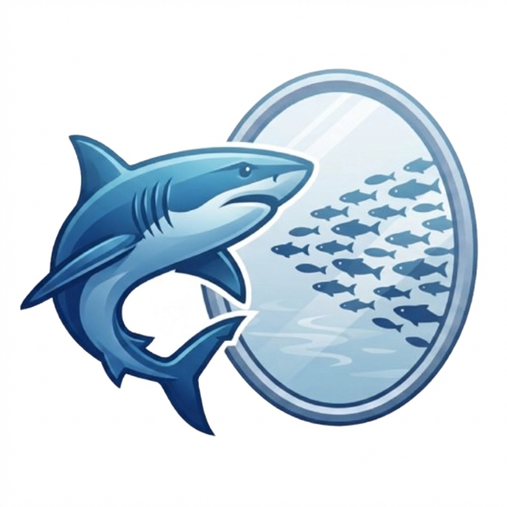

<p align="center">
  
</p>

<h1 align="center">MiroShark</h1>

<p align="center">
  <strong>Universal Swarm Intelligence Engine — Run Locally or with Any Cloud API</strong><br>
  Multi-agent simulation engine: upload any document (press release, policy draft, financial report), and it generates hundreds of AI agents with unique personalities that simulate public reaction on social media — posts, arguments, opinion shifts — hour by hour.
</p>

---

## Screenshots

<div align="center">
<table>
<tr>
<td></td>
<td></td>
</tr>
<tr>
<td></td>
<td></td>
</tr>
<tr>
<td></td>
<td></td>
</tr>
</table>
</div>

## How It Works

1. **Graph Build** — Extracts entities and relationships from your document into a Neo4j knowledge graph with per-agent memory.
2. **Agent Setup** — Generates hundreds of personas, each with unique personality, opinion bias, reaction speed, and influence level.
3. **Simulation** — Agents post, reply, argue, and shift opinions on simulated social platforms. Tracks sentiment evolution and influence dynamics in real time. Supports pause, resume, and restart.
4. **Report** — A ReportAgent analyzes the simulation, interviews a focus group, and generates a structured analysis. Reports are cached.
5. **Interaction** — Chat directly with any agent via persona chat, or send questions to groups. Click any agent to view their full profile and simulation history.

## Quick Start

### Prerequisites

- An OpenAI-compatible API key *(including OpenRouter, OpenAI, Anthropic, etc.)*, Ollama for local inference, **or** Claude Code CLI
- Python 3.11+, Node.js 18+, Neo4j 5.15+ **or** Docker & Docker Compose

---

### Option A: Cloud API (no GPU needed)

Only Neo4j runs locally. LLM and embeddings use a cloud provider.

```bash
# 1. Start Neo4j (or: brew install neo4j && brew services start neo4j)
docker run -d --name neo4j \
  -p 7474:7474 -p 7687:7687 \
  -e NEO4J_AUTH=neo4j/miroshark \
  neo4j:5.15-community

# 2. Configure
cp .env.example .env
```

Edit `.env` (example using OpenRouter):

```bash
LLM_API_KEY=sk-or-v1-your-key
LLM_BASE_URL=https://openrouter.ai/api/v1
LLM_MODEL_NAME=qwen/qwen3-235b-a22b-2507

EMBEDDING_PROVIDER=openai
EMBEDDING_MODEL=openai/text-embedding-3-small
EMBEDDING_BASE_URL=https://openrouter.ai/api
EMBEDDING_API_KEY=sk-or-v1-your-key
EMBEDDING_DIMENSIONS=768
```

```bash
npm run setup:all && npm run dev
```

Open `http://localhost:3000` — backend API at `http://localhost:5001`.

---

### Option B: Docker — Local Ollama

```bash
git clone https://github.com/aaronjmars/MiroShark.git
cd MiroShark
docker compose up -d

# Pull models into Ollama
docker exec miroshark-ollama ollama pull qwen3.5:27b
docker exec miroshark-ollama ollama pull nomic-embed-text
```

Open `http://localhost:3000`.

---

### Option C: Manual — Local Ollama

```bash
# 1. Start Neo4j
docker run -d --name neo4j \
  -p 7474:7474 -p 7687:7687 \
  -e NEO4J_AUTH=neo4j/miroshark \
  neo4j:5.15-community

# 2. Start Ollama & pull models
ollama serve &
ollama pull qwen3.5:27b
ollama pull nomic-embed-text

# 3. Configure & run
cp .env.example .env
npm run setup:all
npm run dev
```

---

### Option D: Claude Code (no API key needed)

Use your Claude Pro/Max subscription as the LLM backend via the local Claude Code CLI. No API key or GPU required — just a logged-in `claude` installation.

```bash
# 1. Install Claude Code (if not already)
npm install -g @anthropic-ai/claude-code

# 2. Log in (opens browser)
claude

# 3. Start Neo4j
docker run -d --name neo4j \
  -p 7474:7474 -p 7687:7687 \
  -e NEO4J_AUTH=neo4j/miroshark \
  neo4j:5.15-community

# 4. Configure
cp .env.example .env
```

Edit `.env`:

```bash
LLM_PROVIDER=claude-code
# Optional: pick a specific model (default uses your Claude Code default)
# CLAUDE_CODE_MODEL=claude-sonnet-4-20250514
```

You still need embeddings — use a cloud provider or local Ollama for those (Claude Code doesn't support embeddings). You also still need Ollama or a cloud API for the CAMEL-AI simulation rounds (see coverage table below).

```bash
npm run setup:all && npm run dev
```

> **What's covered:** When `LLM_PROVIDER=claude-code`, all MiroShark services route through Claude Code — graph building (ontology, NER), agent profile generation, simulation config, report generation, and persona chat. The only exception is the CAMEL-AI simulation engine itself, which requires an OpenAI-compatible API (Ollama or cloud) since it manages its own LLM connections internally.

| Component | Claude Code | Needs separate LLM |
|---|---|---|
| Graph building (ontology + NER) | Yes | — |
| Agent profile generation | Yes | — |
| Simulation config generation | Yes | — |
| Report generation | Yes | — |
| Persona chat | Yes | — |
| CAMEL-AI simulation rounds | — | Yes (Ollama or cloud) |
| Embeddings | — | Yes (Ollama or cloud) |

> **Performance note:** Each LLM call spawns a `claude -p` subprocess (~2-5s overhead). Best for small simulations or hybrid mode — use Ollama/cloud for the high-volume simulation rounds, Claude Code for everything else.

---

## Configuration

### Recommended Models

A typical simulation runs ~40 turns × 100+ agents. Pick a model that balances cost and quality for that volume.

#### Cloud (OpenRouter)

| Model | ID | Cost/sim | Notes |
|---|---|---|---|
| **Qwen3 235B A22B** ⭐ | `qwen/qwen3-235b-a22b-2507` | ~$0.30 | Best overall |
| GPT-5 Nano | `openai/gpt-5-nano` | ~$0.41 | Budget option |
| Gemini 2.5 Flash Lite | `google/gemini-2.5-flash-lite` | ~$0.58 | Good alt |
| DeepSeek V3.2 | `deepseek/deepseek-v3.2` | ~$1.11 | Stronger agentic reasoning |

**Embeddings:** `openai/text-embedding-3-small` on OpenRouter. Keep `EMBEDDING_DIMENSIONS=768`.

#### Local (Ollama)

> **Context override required.** Ollama defaults to 4096 tokens, but MiroShark prompts need 10–30k. Create a custom Modelfile:
>
> ```bash
> printf 'FROM qwen3:14b\nPARAMETER num_ctx 32768' > Modelfile
> ollama create mirosharkai -f Modelfile
> ```

| Model | VRAM | Speed | Notes |
|---|---|---|---|
| `qwen3.5:27b` | 20GB+ | ~40 t/s | Best quality |
| `qwen3.5:35b-a3b` *(MoE)* | 16GB | ~112 t/s | Fastest — MoE activates only 3B params |
| `qwen3:14b` | 12GB | ~60 t/s | Solid balance |
| `qwen3:8b` | 8GB | ~42 t/s | Minimum viable; 40K context limit |

**Hardware quick-pick:**

| Setup | Model |
|---|---|
| RTX 3090/4090 or M2 Pro 32GB+ | `qwen3.5:27b` |
| RTX 4080 / M2 Pro 16GB | `qwen3.5:35b-a3b` |
| RTX 4070 / M1 Pro | `qwen3:14b` |
| 8GB VRAM / laptop | `qwen3:8b` |

**Embeddings locally:** `ollama pull nomic-embed-text` — 768 dimensions, matches Neo4j default.

**Hybrid tip:** Run local for simulation rounds (high-volume), route to a cloud model only for final report generation. Most users land here naturally — see **Smart Model** below.

### Smart Model

Set `SMART_MODEL_NAME` to route intelligence-sensitive workflows through a stronger model while keeping everything else on your default (cheaper/faster) model. When not set, all workflows use the same model.

**What uses the smart model:**

| Workflow | Why |
|---|---|
| Report generation | Multi-turn reasoning, end-user facing output |
| Ontology extraction | Foundational — defines the entire knowledge graph schema |
| Graph reasoning | Sub-question generation, deep search during reports |

**Everything else** (NER extraction, profile generation, simulation config) stays on the default model — these are high-volume and don't need top-tier reasoning.

**Example configs:**

```bash
# Ollama for bulk work, Claude Code for reports
LLM_MODEL_NAME=qwen3.5:27b
SMART_PROVIDER=claude-code
SMART_MODEL_NAME=claude-sonnet-4-20250514

# Ollama for bulk work, OpenRouter premium for reports
LLM_MODEL_NAME=qwen3.5:27b
SMART_PROVIDER=openai
SMART_API_KEY=sk-or-v1-your-key
SMART_BASE_URL=https://openrouter.ai/api/v1
SMART_MODEL_NAME=anthropic/claude-sonnet-4

# Same provider, just a bigger model for reports
LLM_MODEL_NAME=qwen3:8b
SMART_MODEL_NAME=qwen3.5:27b
```

If only `SMART_MODEL_NAME` is set (without `SMART_PROVIDER`/`SMART_BASE_URL`/`SMART_API_KEY`), the smart model inherits the default provider settings — useful when you just want a bigger model on the same backend.

### Environment Variables

All settings live in `.env` (copy from `.env.example`):

```bash
# LLM (default — used for bulk/high-volume workflows)
LLM_PROVIDER=openai                # "openai" (default) or "claude-code"
LLM_API_KEY=ollama                  # Not needed for claude-code mode
LLM_BASE_URL=http://localhost:11434/v1
LLM_MODEL_NAME=qwen3.5:27b

# Smart model (optional — used for reports, ontology, graph reasoning)
# SMART_PROVIDER=claude-code       # "openai", "claude-code", or empty (inherit)
# SMART_MODEL_NAME=claude-sonnet-4-20250514
# SMART_API_KEY=                    # Only if different from LLM_API_KEY
# SMART_BASE_URL=                   # Only if different from LLM_BASE_URL

# Claude Code mode (only when LLM_PROVIDER=claude-code)
# CLAUDE_CODE_MODEL=claude-sonnet-4-20250514

# Neo4j
NEO4J_URI=bolt://localhost:7687
NEO4J_USER=neo4j
NEO4J_PASSWORD=miroshark

# Embeddings
EMBEDDING_PROVIDER=ollama          # "ollama" or "openai"
EMBEDDING_MODEL=nomic-embed-text
EMBEDDING_BASE_URL=http://localhost:11434
EMBEDDING_DIMENSIONS=768
```


---

## Hardware Requirements

**Local (Ollama):**

| | Minimum | Recommended |
|---|---|---|
| RAM | 16 GB | 32 GB |
| VRAM | 10 GB | 24 GB |
| Disk | 20 GB | 50 GB |

**Cloud mode:** No GPU needed — just Neo4j and an API key. Any 4 GB RAM machine works.

## Use Cases

- **PR crisis testing** — simulate public reaction to a press release before publishing
- **Trading signals** — feed financial news and observe simulated market sentiment
- **Policy analysis** — test draft regulations against a simulated public
- **Creative experiments** — feed a novel with a lost ending; agents write a narratively consistent conclusion

## License

AGPL-3.0. See [LICENSE](./LICENSE).

## Credits

Built on [MiroFish](https://github.com/666ghj/MiroFish) by [666ghj](https://github.com/666ghj) (Shanda Group). Neo4j + Ollama storage layer adapted from [MiroFish-Offline](https://github.com/nikmcfly/MiroFish-Offline) by [nikmcfly](https://github.com/nikmcfly). Simulation engine powered by [OASIS](https://github.com/camel-ai/oasis) (CAMEL-AI).
