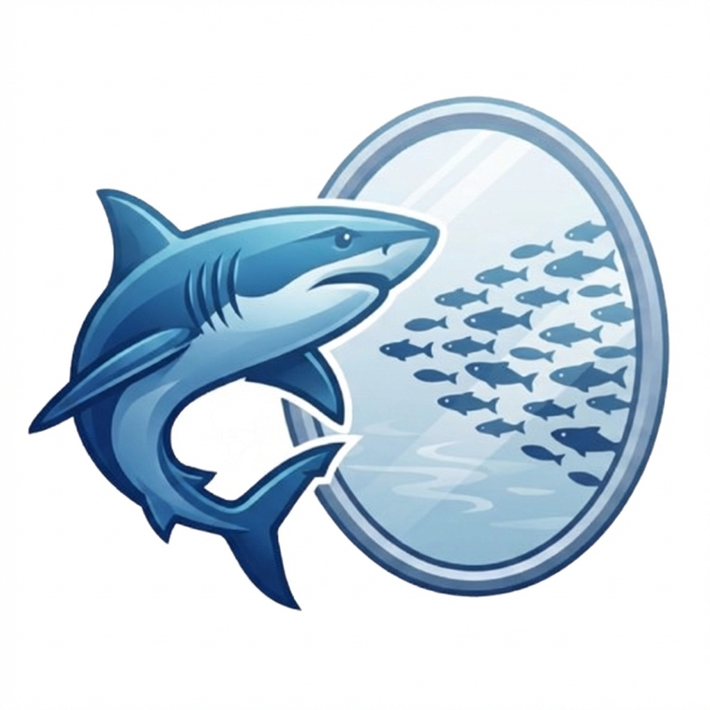
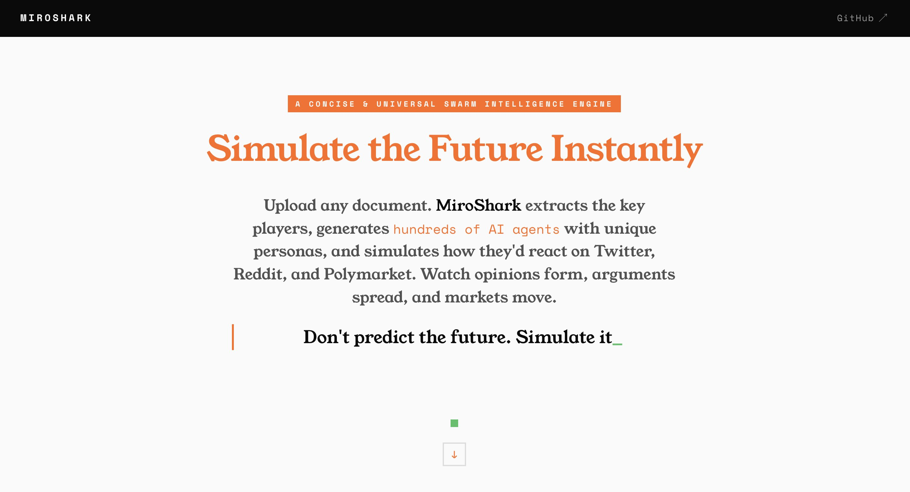
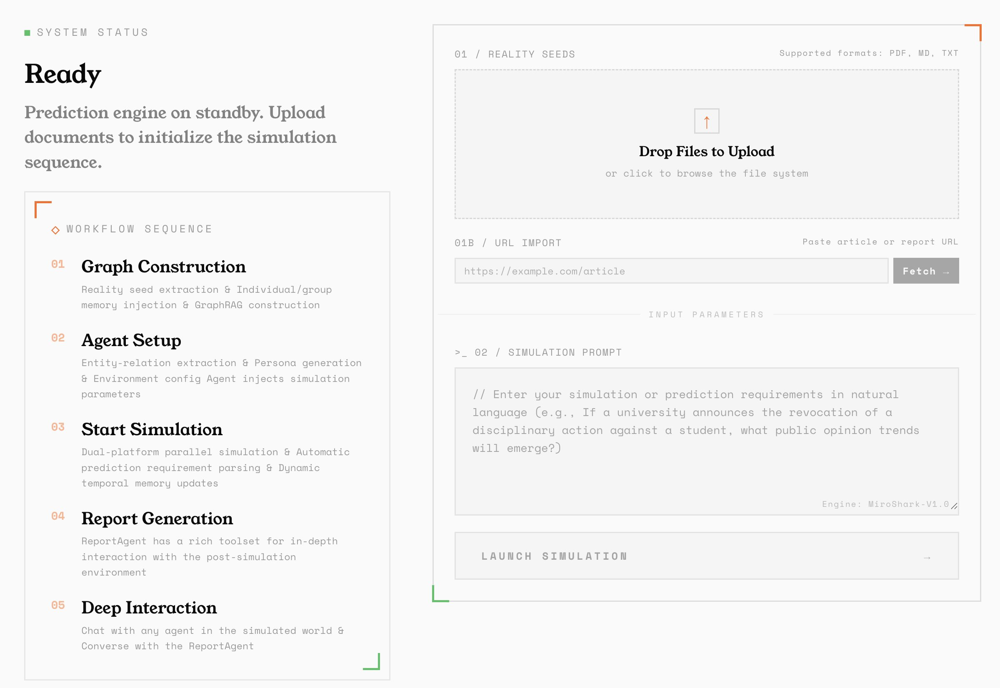
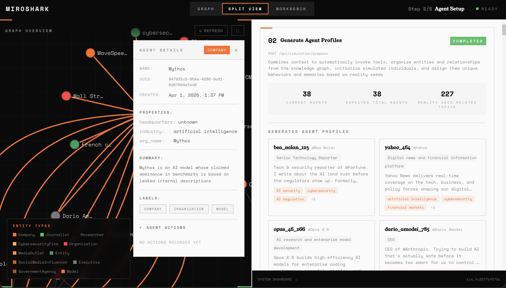
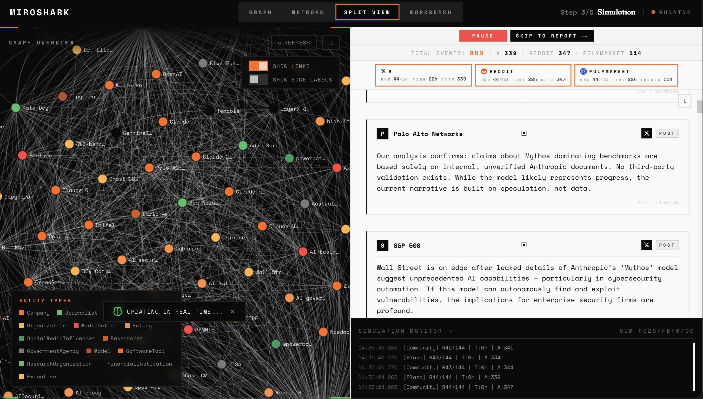
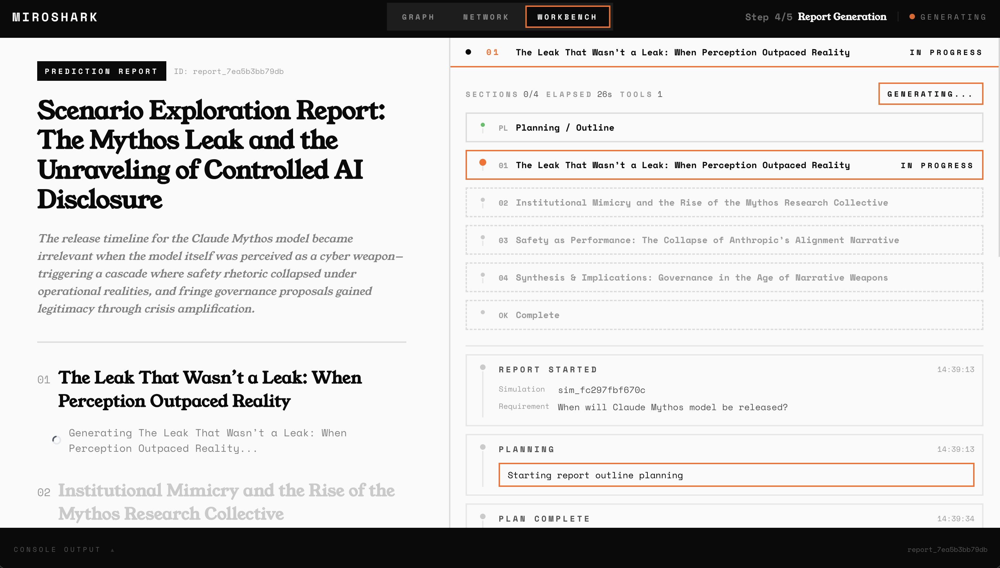
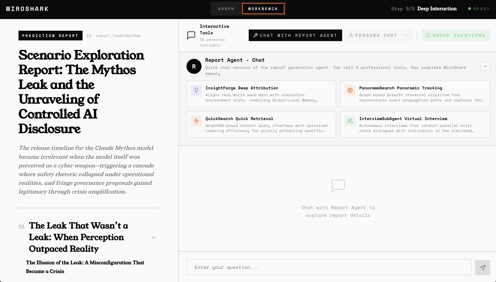

<p align="center">
  
</p>

<h1 align="center">MiroShark</h1>

<p align="center">
  <a href="https://github.com/aaronjmars/MiroShark/stargazers"></a>
  <a href="https://github.com/aaronjmars/MiroShark/network/members"></a>
  <a href="https://x.com/miroshark_"></a>
  <a href="https://bankr.bot/discover/0xd7bc6a05a56655fb2052f742b012d1dfd66e1ba3"></a>
</p>

<p align="center">
  <strong>Simulate anything, for $1 &amp; less than 10 min — Universal Swarm Intelligence Engine</strong><br>
  Drop in anything — a press release, a news headline, a policy draft, a question you can't answer, a historical what-if — and MiroShark spawns hundreds of agents that react to it hour by hour. Posting, arguing, trading, changing their minds.
</p>

<p align="center">
  
</p>

---

## What it does

- You bring a scenario. MiroShark builds the world around it.
- Hundreds of grounded agents. Twitter, Reddit, and a prediction market. Hour by hour.
- Chat with any of them. Drop breaking news mid-run. Fork the timeline.
- Get a report on what happened, citing actual posts and trades.

## Quick start

The recommended path: **one [OpenRouter](https://openrouter.ai/) key + the `./miroshark` launcher.** First simulation in ~10 min, ~$1 (Cheap preset) to ~$3.50 (Best preset).

**Prereqs** — Python 3.11+, Node 18+, Neo4j, and an [OpenRouter key](https://openrouter.ai/).

Install Neo4j — the launcher starts it for you:

- **macOS** — `brew install neo4j`
- **Linux** — `sudo apt install neo4j` *(or your distro's equivalent)*
- **Windows** — install [Neo4j Desktop](https://neo4j.com/download/) *(native, GUI — start the DB there, then run the launcher from WSL2 or Git Bash)*, or run the whole stack inside [WSL2](https://learn.microsoft.com/windows/wsl/install) and follow the Linux steps
- **Zero-install** — create a free [Neo4j Aura](https://neo4j.com/cloud/aura-free/) cloud instance and point `NEO4J_URI` / `NEO4J_PASSWORD` at it in `.env`

Then:

```bash
git clone https://github.com/aaronjmars/MiroShark.git && cd MiroShark
cp .env.example .env
# Open .env and paste your OpenRouter key into the Best or Cheap preset block
./miroshark
```

The launcher checks dependencies, starts Neo4j, installs frontend + backend, and serves `:3000` + `:5001`. Ctrl+C stops everything. Open `http://localhost:3000` and drop in a document.

**Other paths** — [one-click Railway / Render deploy](docs/INSTALL.md#one-click-cloud), [Docker + Ollama](docs/INSTALL.md#option-b-docker--local-ollama), [manual Ollama](docs/INSTALL.md#option-c-manual--local-ollama), [Claude Code CLI](docs/INSTALL.md#option-d-claude-code-no-api-key) — all in **[docs/INSTALL.md](docs/INSTALL.md)**.

<p align="center">
  
</p>

## Features

| Feature | What it does |
|---|---|
| **Smart Setup** | Drop in a doc → three auto-generated Bull / Bear / Neutral scenarios in ~2s |
| **What's Trending** | Pick a live news item from RSS feeds; pre-fills the scenario in one click |
| **Just Ask** | Type a question with no document — MiroShark researches and writes the seed briefing |
| **Counterfactual Branching** | Fork a running simulation with an injected event ("what if the CEO resigns in round 24?") |
| **Director Mode** | Inject breaking news into the *current* timeline without forking |
| **Preset Templates** | 6 benchmarked scenarios: crypto launch, corporate crisis, political debate, product announcement, campus controversy, historical what-if |
| **Live Oracle Data** | Opt-in grounded seeds from the [FeedOracle](https://mcp.feedoracle.io/mcp) MCP (484 tools) |
| **Per-Agent MCP Tools** | Personas can invoke real MCP tools (web search, APIs) during simulation |
| **Embed & Publish** | Public/private toggle + embed URLs for sharing finished runs |
| **Social Share Card** | 1200×630 PNG that auto-unfurls scenario, status, quality, and belief split on Twitter/X, Discord, Slack, LinkedIn |
| **Article Generation** | Substack-style write-up of what happened, grounded in actual posts and trades |
| **Interaction Network** | Force-directed agent-to-agent graph with echo-chamber metrics |
| **Demographics** | Archetype clustering (analyst / influencer / retail / observer…) |
| **Quality Diagnostics** | Health score per run — engagement, coherence, diversity, variance |
| **History Database** | Search, clone, export, or delete any past simulation |
| **Trace Interview** | See the full reasoning chain behind an agent's reply, not just the reply |
| **Push Notifications** | Web-push alerts when long-running graph / sim / report jobs finish |

Each feature is documented in **[docs/FEATURES.md](docs/FEATURES.md)**.

## Use cases

- **PR crisis testing** — simulate public reaction to a press release before publishing
- **Market reaction** — feed financial news and observe simulated trader + investor sentiment
- **Advertisement** — test a campaign, headline, or pitch against a simulated audience before spending
- **Policy analysis** — test draft regulations against a simulated public
- **Life decision** — frame a personal decision (job move, relocation, launch timing) as a scenario and watch diverse personas argue it out
- **What-if history** — rewrite a historical event and see how a population of personas re-narrates the aftermath
- **Creative experiments** — feed a novel with a lost ending; agents write a narratively consistent conclusion

## Screenshots

<div align="center">
<table>
<tr><td></td><td></td></tr>
<tr><td></td><td></td></tr>
<tr><td></td><td></td></tr>
</table>
</div>

<div align="center">
<table>
<tr>
<td></td>
<td></td>
</tr>
</table>
</div>

## Documentation

| | |
|---|---|
| [Install](docs/INSTALL.md) | Every deployment path: cloud, Docker, Ollama, Claude Code |
| [Configuration](docs/CONFIGURATION.md) | Env vars, model routing, feature flags |
| [Models](docs/MODELS.md) | Cheap vs Best presets, local Ollama models, benchmark findings |
| [Architecture](docs/ARCHITECTURE.md) | Simulation engine, memory pipeline, graph retrieval |
| [Features](docs/FEATURES.md) | Deep dive on every feature in the table above |
| [HTTP API](docs/API.md) | Every endpoint, grouped by concern |
| [CLI](docs/CLI.md) | `miroshark-cli` reference |
| [MCP](docs/MCP.md) | Claude Desktop integration + report agent tools |
| [Observability](docs/OBSERVABILITY.md) | Debug panel, event stream, logging |
| [Contributing](CONTRIBUTING.md) | Tests and development |

## License

AGPL-3.0. See [LICENSE](./LICENSE).

Support the project: `0xd7bc6a05a56655fb2052f742b012d1dfd66e1ba3`

## Star History

[](https://www.star-history.com/#aaronjmars/miroshark&Date)
